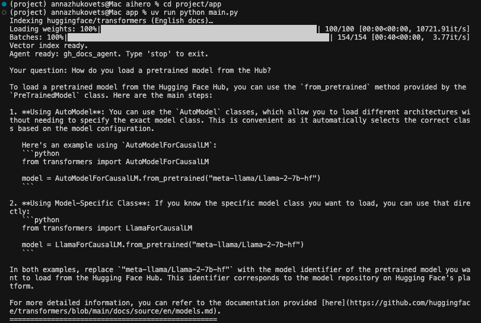
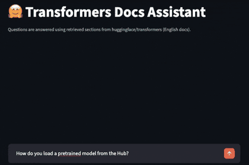

 # 🤗 Transformers Docs Assistant

An AI-powered assistant that helps you quickly find answers in the
[Hugging Face Transformers](https://github.com/huggingface/transformers) documentation.

Built as a project for the [AI Agents Crash Course](https://alexeygrigorev.com/aihero/).

---

## Overview

Large documentation repositories are hard to navigate from a notebook or from search alone.
This project solves that by providing a conversational assistant that:

- downloads Markdown from the Transformers GitHub repo
- splits documents into sections (by headings)
- builds a vector index over the sections (SentenceTransformers + `minsearch.VectorSearch`)
- retrieves relevant chunks with a search tool
- generates helpful answers with citations

The app is available in two modes:

- **CLI** (terminal)
- **Web UI** (Streamlit)

Both modes log interactions to JSON for debugging and evaluation.

---

## Installation

Requirements:

- Python 3.12+
- [uv](https://github.com/astral-sh/uv)

From the repo root:

```bash
cd project
uv sync
```

Then install app dependencies:

```bash
cd project/app
uv sync
```

---

## Usage

### API key

Set up your OpenAI API key:

```bash
export OPENAI_API_KEY="your-key"
```

### CLI mode

```bash
uv run python main.py
```



Type questions; enter `stop` to exit.

### Web UI mode

```bash
uv run streamlit run app.py
```



Open the Streamlit app in your browser and chat with the assistant.

---

## Features

- 🔎 Markdown chunking via heading splits
- 🔍 Semantic retrieval with `minsearch.VectorSearch` + SentenceTransformers embeddings
- 🤖 AI-generated answers powered by `pydantic-ai` + OpenAI (`gpt-4o-mini`)
- 📂 Direct GitHub blob references in answers
- 🖥️ Two interfaces: CLI (`main.py`) and Streamlit (`app.py`)
- 📝 Automatic logging of conversations into JSON files (`logs/` by default)
- 🧵 Streaming responses in Streamlit

---

## Evaluations

We evaluate the agent using a checklist of criteria such as:

- `instructions_follow`: The agent followed the user's instructions
- `instructions_avoid`: The agent avoided doing things it was told not to do  
- `answer_relevant`: The response directly addresses the user's question  
- `answer_clear`: The answer is clear and correct  
- `answer_citations`: The response includes proper citations or sources when required  
- `completeness`: The response is complete and covers all key aspects of the request
- `tool_call_search`: Is the search tool invoked? 

We do this in two steps:

- First, we generate synthetic questions (see [`eval/data-gen.ipynb`](eval/data-gen.ipynb))
- Next, we run our agent on the generated questions and check the criteria (see [`eval/evaluations.ipynb`](eval/evaluations.ipynb))

Current evaluation metrics:

```
instructions_follow     70.0
instructions_avoid     100.0
answer_relevant        100.0
answer_clear            90.0
answer_citations        80.0
completeness            70.0
tool_call_search       100.0
```

The most important metric for this project is `answer_relevant`. This measures whether the system's answer is relevant to the user. It's currently 100%, meaning all answers were relevant. 

Improvements: Our evaluation is currently based on only 10 questions. We need to collect more data for a more comprehensive evaluation set.

---

## Project file overview

`app.py`: Streamlit-based web UI.

`main.py`: CLI entrypoint (interactive terminal loop).

`ingest.py`: Downloads Markdown from GitHub, chunks by headings, embeds the chunks, and fits the vector index.

`search_tools.py`: Wraps the vector index into a `search(query)` tool used by the agent.

`search_agent.py`: Defines the Pydantic AI agent and attaches the search tool + system prompt.

`logs.py`: Logs each interaction into JSON files under `logs/` (configurable via `LOGS_DIRECTORY`).

---

## Tests

TODO: add tests.

```bash
cd project/app
uv run pytest
```

---

## Deployment

To deploy the Streamlit app on Streamlit Cloud:

1. Generate a `requirements.txt` file from your `uv` environment:

   ```bash
   cd project/app
   uv export > requirements.txt
   ```

2. Make sure `OPENAI_API_KEY` is configured in the Streamlit Cloud settings.
3. Run:

   ```bash
   uv run streamlit run app.py
   ```

---

## Credits / Acknowledgments

- [Hugging Face Transformers](https://github.com/huggingface/transformers) for the open documentation source
- [AI Agents Crash Course](https://alexeygrigorev.com/aihero/) for the project structure and evaluation approach
- Main libraries: `pydantic-ai` (agents), `minsearch` (search), `sentence-transformers` (embeddings), `streamlit` (UI)

